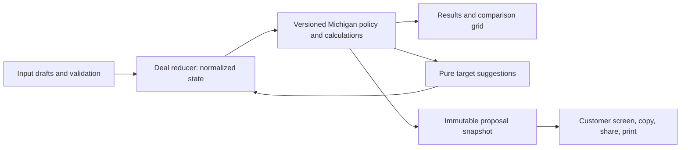

# Operating and release handoff

## Purpose and ownership

Payment Desk supports an estimate conversation. It does not approve credit, choose lender eligibility, generate a binding contract, collect credit applications, provide a cloud customer database, or synchronize with a DMS/CRM. Preserve that scope unless a separate requirement defines data access, retention, and approved financial integrations.

Before handing operation to another company, record actual people and business accounts for these roles. No unconfirmed owner is assigned here.

| Role | Responsibility |
| --- | --- |
| Dealership product owner | Supported transactions, proposal wording, staff training, and pilot acceptance |
| Dealership policy owner | CRV definition, document-fee basis, setting both fees in Settings on each device, product taxability, fee exceptions, lender/DMS reference examples, and annual review |
| Technical maintainer | Repository access, release checks, dependency updates, rollback, support triage, and deployment settings |
| Business account owner | Repository/domain ownership, approved brand assets and commercial rights, recovery access, and departing-staff access removal |

The existing repository is under a personal GitHub account. Agree on business ownership and recovery access before transferring responsibility. Do not assume code publication grants rights to dealership branding or changes who owns the software.

## Architecture and change boundaries

- `Fields.jsx`, `inputValidation.js`, and `ValidationContext.jsx` separate incomplete/invalid text from committed figures. Invalid drafts preserve the last valid estimate and block proposal actions.
- `dealState.js` owns deal changes, rate/grid synchronization, view transitions, reset, and one-step undo expiry. Use reducer actions rather than direct component state patches for financial changes.
- `deskDraft.js` validates and stores the current worksheet locally; `DraftContext.jsx` carries unfinished numeric/date inputs. Restore invalid text as invalid, and keep Reset responsible for clearing the draft. The website and companion have separate storage origins.
- `calculations.js` uses cent-based money and exact rational payment-cent rounding and validated two-decimal annual interest-rate entry. `suggestions.js` evaluates the same normalized patch it presents and applies.
- `policy.js` records rule versions, dates, sources, and supported scope. Extend its review window only after checking the applicable fees/taxes and updating regression fixtures.
- `proposal.js` creates the reference, date/version, itemized groups, selected figures, and qualifications used for customer export. A generic calculator link opens the recipient's calculator and may restore that device's own draft; it does not transfer a proposal.
- `release.js` and the Vite build identify the app version and source revision. Include both, the estimate reference/date, browser, and reproduction steps in a defect report. Avoid customer names or unnecessary financial data in diagnostic services.

Keep this small React/Vite application unless agreed requirements justify a server. A full TypeScript migration is optional; the implemented JSDoc/domain boundaries and executable tests are the current maintenance contract.

## Policy approval and scope

The policy code contains primary Michigan Treasury, SOS, and DIFS source links. The current fee review window covers 2026. Scheduled later-year trade credits are available for inspection, but policy expiry prevents unqualified proposal export until review. From 30 days before the window ends (December 1, 2026), Dealer view shows a reminder under the header; have the rules reviewed, extend `policy.js`, and release before January 1, or estimates dated 2027 cannot be exported.

**The policy owner sets the document fee and CRV dealer fee in Settings → Fees on each device** (phones, tablets and desk computers each keep their own settings). Blank uses the default ($280 and $34). The settings are stored in each browser (`payment-desk.fees.v1`); a new device, a cleared browser, or **Clear dealership settings** returns to the defaults. Both fees are taxable, and the estimate assumptions state the amounts charged.

The documentary fee uses selling price as a conservative estimate basis: whatever fee is set, the fee charged is the lower of that setting, $280, or 5% of the selling price, rounded down to cents, on both purchase modes. The calculation enforces both caps even if a bad value reaches it. This does not certify the dealership's exact statutory cash-price basis. Confirm the approved DMS/contract method with the policy owner before relying on it for low-price transactions.

Confirm the meaning, amount, and taxability of CRV (settable from $0 to $999.99); the correct treatment of Service Contract, Gap, and each Other product; and registration/title exceptions. Other positive charges require a name and an explicit Taxable or Not taxable selection before proposal export. Mathematical price/trade/rate suggestions are not manager authorization, product consent, or lender approval.

Regular monthly amortization excludes odd first periods, daily interest timing, lender-specific charges, and a reconciled final installment. Reported interest/total payments remain analytical estimates. Reconcile representative lender/DMS cases before widening use. Manufacturer rebates need their own after-tax treatment if implemented; never subtract one from the taxable selling price merely to fit the current model.

## Local checks and release

Use the README setup commands. The release command builds first, then tests the production output in desktop Chromium, mobile Chromium, and desktop WebKit. Browser failures retain screenshots/traces; CI retains report artifacts for 14 days. Use synthetic figures in tests.

Both workflows run `npm run check:release`. CI runs on PRs and pushes, including main. The Pages build validates before uploading `dist`; only the deploy job can publish and request OIDC credentials. Build permissions are read-only; action references are pinned to reviewed commit SHAs. Manual dispatch from a branch other than main cannot deploy.

Repository settings are separate from workflow files and are **not enabled by this documentation**. In GitHub:

1. Create a main-branch ruleset requiring a PR and the **Release checks** job from the CI workflow. Select the check after its first successful run; do not substitute a Pages deploy status for validation.
2. Require review for policy/calculation and workflow changes. Document who may use an emergency bypass and require a follow-up review.
3. Keep the `github-pages` environment limited to main. Confirm Pages uses GitHub Actions. Restrict account access to maintainers; retain recovery access for the business owner.
4. Review Dependabot PRs for npm and Actions. Confirm the pinned Action SHA and version comment remain aligned, then run the same release checks.

A normal release is a reviewed PR merged to main after validation and the applicable acceptance checks. The GitHub Pages workflow does not update the custom-domain Cloudflare production site. For that site, follow [the Cloudflare deployment guide](CLOUDFLARE-DEPLOYMENT.md), build the accepted main commit and upload to the existing `mysoldlog-desking` Pages project. After deployment, verify the displayed build ID, a known estimate, mobile navigation, and one customer export. Record the release URL/run, commit, validation evidence, and any remaining business limitations. No code in this guide automatically performs a deployment or repository-settings change.

## Rollback and support

Identify the last accepted release from its commit and deployment run. Make a new branch from current main, revert the problematic change through a reviewed PR (or restore the affected files from the accepted commit into a new reviewable change), run `check:release`, and merge normally. Do not force-push or erase release history. Recheck the published build and known estimate after rollback.

For an urgent failure, preserve its build ID and reproducible synthetic case, then stop relying on the affected calculator workflow and use the dealership's approved systems while the fix is reviewed. The browser error boundary can reset a broken deal but is not a recovery store. An agreed owner should receive deployment failures and a simple availability/smoke check; this change does not configure an external monitoring account or recurring automation.

The app automatically saves the current worksheet draft (`payment-desk.draft.v2`) in this browser on this device, including figures, products, grid settings, targets and unfinished numeric/date inputs. Refresh restores Dealer view. **Reset deal** clears the draft; reset when finished on shared devices. Website and companion drafts are separate. Storage failures are reported in the footer; keep the page open until the current estimate is copied or printed. Clearing site data or removing the extension can erase its draft. This is one local draft, not a saved-proposal library or cloud synchronization.

Dealership name/logo (`payment-desk.dealership.v1`), fees (`payment-desk.fees.v1`) and the public identifier of a connected companion (`payment-desk.companion.v1`) are saved separately. **Clear dealership settings** removes presentation and fees. Inventory remains in the Chrome companion until disconnected there; its website bridge cannot read the companion draft. The website has no offline worker, external font request or analytics collector. If a proposal library, customer identities, synchronization or restricted access are later added, explicitly choose their retention, access, shared-device reset and support model first.

## Commercial and national gate

See [ATC requirements](ATC-INTEGRATION-REQUIREMENTS.md) and [coverage acceptance](NATIONWIDE-COVERAGE.md). No provider is connected. Preserve explicit Michigan-only guards until licensed, validated automotive state/local rules are available. Worksheets remain on each device; a future stateless broker is a separate approved computation/data-handling design, not cloud deal storage.

Before a commercial handoff, name the operator and backups, record code/brand/data rights, approve actual privacy and distribution materials, establish private security reporting and staffed support, and verify account/recovery ownership. Do not fill these with invented contacts, legal terms or promises. Runtime license texts ship in `THIRD-PARTY-NOTICES.txt`; regenerate after dependency changes. Technical data handling is documented in the app, but is not an operator-approved business privacy policy.

For local format rollback, v2 takes precedence over legacy v1. Old app versions cannot understand v2; rolling code back does not downgrade or clear it. Preserve bytes and use a compatible release for recovery. Reset writes a figures-free v2 marker and attempts legacy cleanup under the shared lock; unreadable records require explicit discard and failures remain visible.
